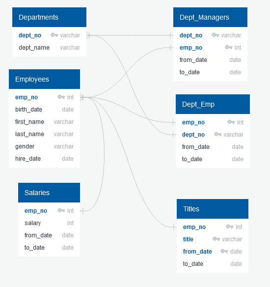
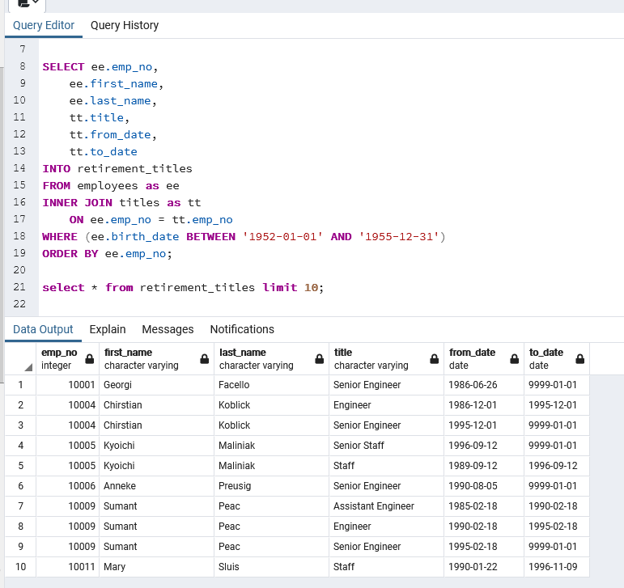
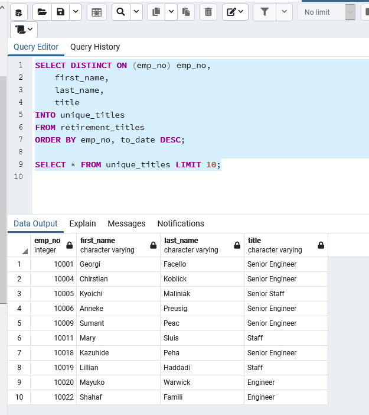
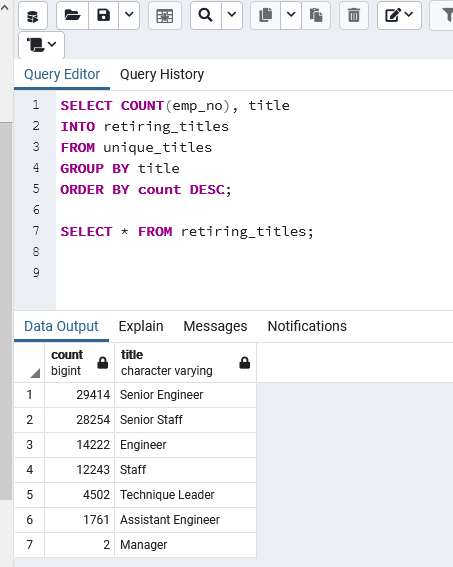
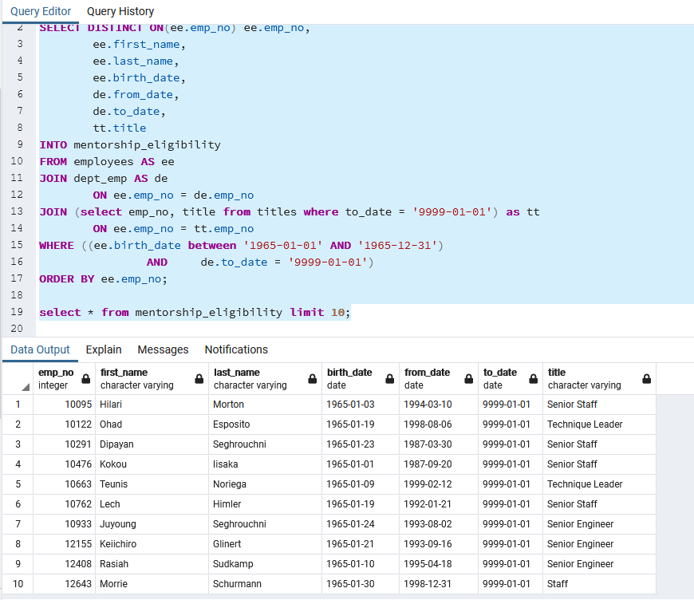
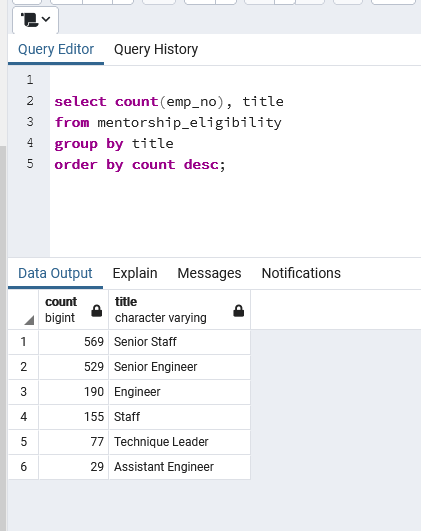

# Pewlett-Hackard-Analysis

## Project Overview

The purpose of this analysis is to:
- determine the number of retiring employees per title
- identify employees who are eligible to participate in a mentorship program.

## Results

We performed our analysis by completing the following steps.

#### Create database in PostgreSQL - ERD and Schema

Entity Relationship Diagram (Physical) created with http://quickdatabasedagrams.com


Pewlett-Hackard Database Schema for Postgresql
```
CREATE TABLE departments (
        dept_no VARCHAR(4) NOT NULL,
        dept_name VARCHAR(40) NOT NULL,
        PRIMARY KEY (dept_no),
        UNIQUE (dept_name)
);
CREATE TABLE employees (
        emp_no INT NOT NULL,
        birth_date DATE NOT NULL,
        first_name VARCHAR NOT NULL,
        last_name VARCHAR NOT NULL,
        gender VARCHAR NOT NULL,
        hire_date DATE NOT NULL,
        PRIMARY KEY (emp_no)
);
CREATE TABLE dept_manager (
        dept_no VARCHAR(4) NOT NULL,
        emp_no INT NOT NULL,
        from_date DATE NOT NULL,
        to_date DATE NOT NULL,
        FOREIGN KEY (emp_no) REFERENCES employees (emp_no),
        FOREIGN KEY (dept_no) REFERENCES departments (dept_no),
        PRIMARY KEY (emp_no, dept_no)
);
CREATE TABLE salaries (
        emp_no INT NOT NULL,
        salary INT NOT NULL,
        from_date DATE NOT NULL,
        to_date DATE NOT NULL,
        FOREIGN KEY (emp_no) REFERENCES employees (emp_no),
        PRIMARY KEY (emp_no)
);
CREATE TABLE dept_emp (
        emp_no INT NOT NULL,
        dept_no VARCHAR NOT NULL,
        from_date DATE NOT NULL,
        to_date DATE NOT NULL,
        FOREIGN KEY (emp_no) REFERENCES employees (emp_no),
        FOREIGN KEY (dept_no) REFERENCES departments (dept_no),
        PRIMARY KEY (emp_no, dept_no)
);
CREATE TABLE titles (
        emp_no INT NOT NULL,
        title VARCHAR NOT NULL,
        from_date DATE NOT NULL,
        to_date DATE NOT NULL,
        FOREIGN KEY (emp_no) REFERENCES employees (emp_no),
        PRIMARY KEY (emp_no)
);
```

#### Determine the titles held by retirement-eligible employees (born 1952-1955)

SQL code to create the **retirement_titles** table


#### Find the most recently held title for each of the above

SQL code to create the **unique_titles** table


#### Gather counts for each title above

SQL code to create the **retiring_titles** table


#### Determine which employees born in 1965 are eligible for mentorship_eligibility
SQL code to create the **mentorship_eligibility** table



## Summary

**How many roles will need to be filled as the "silver tsunami" begins to make an impact?**

  There are a total of 90,398 employees (out of a total of 300,024) who are eligible for retirement soon. So 30% of the total workforce will leave in the next four years.

  |             | Count | Percent of workforce |
  | ----------- | ----------- | ----------- |
  | Total Employees born betwen 1952 - 1955  | 90,398 |  30.13% |
  | Employees born in 1952 | 21,209 |                     7.07% |
  | Employees born in 1953 | 22,857 |                     7.62% |
  | Employees born in 1954 | 23,228 |                     7.74% |
  | Employees born in 1955 | 23,104 |                     7.70% |

**Are there enough qualified, retirement-ready employees in the departments to mentor the next generation of Pewlett Hackard employees?**

  Counts of employees eligible for mentorship_eligibility


  We can compare that with the number of employees available to be mentors below, and we can see that there are plenty of retirement-ready employees to mentor the next generation of PH employees:

  | Title              | Mentors     | Mentees |
  | -----------        | ----------- | ----------- |
  | Senior Engineer    | 29,414      | 529 |
  | Senior Staff       | 28,254      | 569 |
  | Engineer           | 14,222      | 190 |
  | Staff              | 12,243      | 155 |
  | Technique Leader   |  4,502      |  77 |
  | Assistant Engineer |  1,761      |  29 |
  | Manager            |      2      |   0 |

  It actually looks like PH has the opposite problem. There are not enough younger employees to take up the slack when the retirees are gone.
